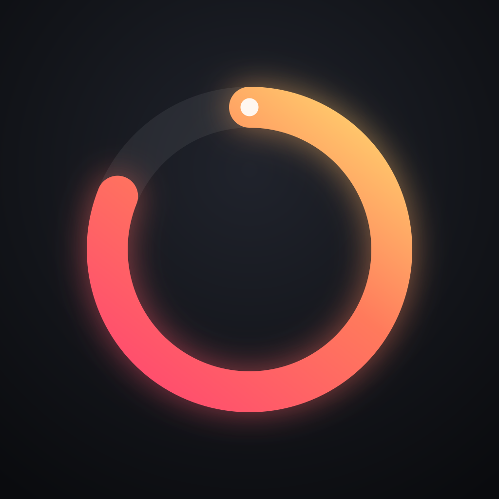
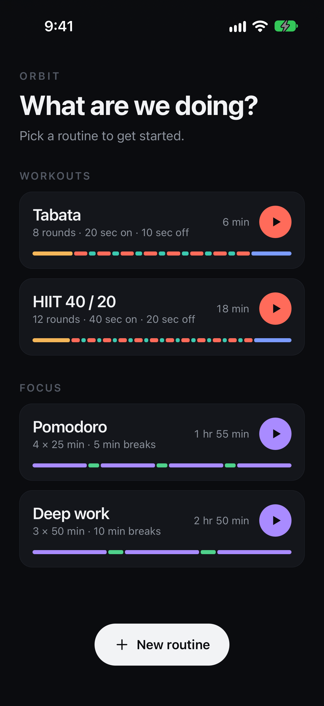
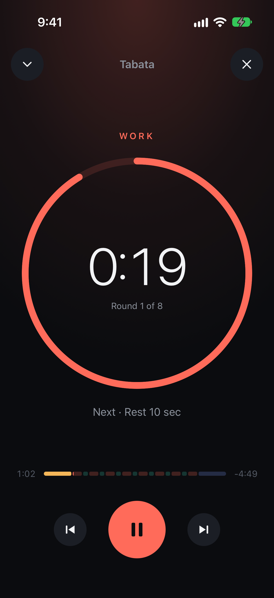
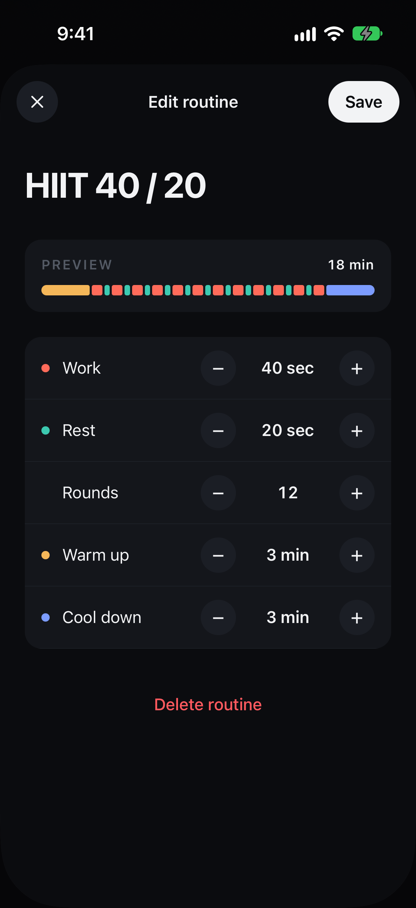
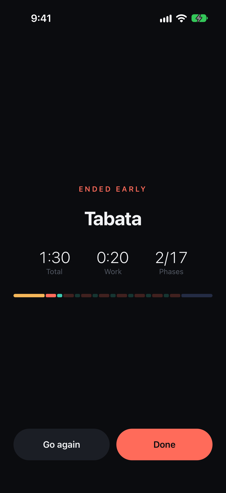
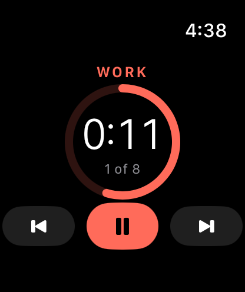
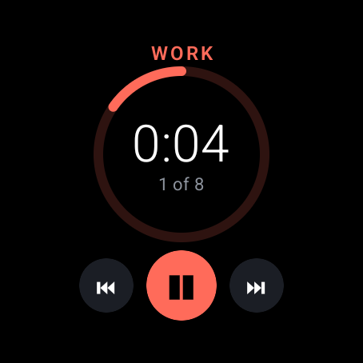
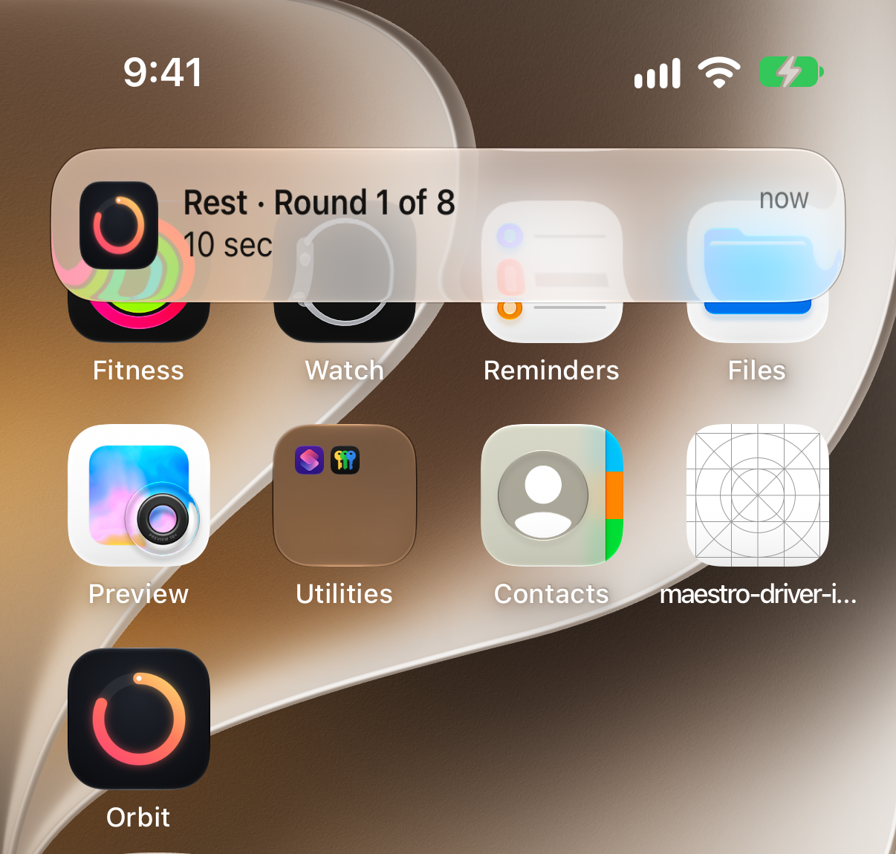

# Orbit

An interval and focus timer for iOS and Android, with companion apps for
Apple Watch and Wear OS.

Workouts (Tabata, HIIT, custom intervals) and focus sessions (Pomodoro, deep
work) share one engine. Start on the phone, glance at the watch, pause from
either. The timer is computed from the clock, so it never drifts, and it
survives the app being killed mid-session.

<p>
  
  
  
  
</p>
<p>
  
  
  
</p>

## Status

| Surface | State |
|---|---|
| Timer engine | Done, fully tested |
| iOS and Android app | Done: routines, editor, live timer, weekly summary |
| Engine in Swift and Kotlin | Done, verified against the TypeScript engine |
| Apple Watch (SwiftUI) | Live countdown, controls, phase haptics. Phone to watch sync verified on simulator |
| Wear OS (Compose) | Live countdown, controls, phase haptics. UI verified on emulator; phone link needs a paired device |
| Background alerts | Done: each phase change is a scheduled local notification (exact alarms on Android). Verified on iOS |

## How it works

### Sessions are timestamps, not ticks

Most timers count down by decrementing a number once a second. That drifts
whenever a frame is late, stops when the OS suspends the app, and can't be
shared with another device without streaming every tick.

Orbit never counts. A session is a small immutable record:

```ts
interface Session {
  routine: Routine;
  phases: Phase[];
  startedAt: number;      // wall clock
  pausedAt: number | null;
  pausedTotalMs: number;
  skippedMs: number;      // skip and back move along the timeline
  finishedAt: number | null;
}
```

Everything on screen is derived from it with one pure function,
`snapshot(session, now)`: the current phase, time left, round, progress,
what's next. The render loop only decides how often to repaint; it never
changes state. That gives three properties for free:

- **No drift.** A late frame shows the right time, it just shows it late.
- **Crash-safe.** The record is persisted on every change. Kill the app
  mid-round, reopen it, and the timer is exactly where it should be. If the
  routine ended while the app was closed, it is recorded as finished at the
  precise moment it ended, not when the app reopened.
- **Cheap to sync.** A watch receives the same record once, after each
  change, and renders the countdown locally. No per-second messages, no
  battery cost, and both screens always agree.

`upcomingBoundaries(session, now)` returns the wall-clock time of every
remaining phase change, which is what background notifications and haptics
are scheduled from.

### Pause, skip and back are arithmetic

- Pause records `pausedAt`; resume adds the gap to `pausedTotalMs`.
- Skip adds the rest of the current phase to `skippedMs`.
- Back rewinds to the start of the phase, or to the previous phase if pressed
  within two seconds of a change, like a music player.

Every operation is a pure `(session, now) => session` function, so the whole
engine is tested without fake timers. See
[`src/engine/__tests__`](src/engine/__tests__/engine.test.ts).

### One engine, three languages, one test suite

The phone runs the engine in TypeScript; the watches run it natively, in
Swift on watchOS and Kotlin on Wear OS. Three implementations of the same
logic will drift apart unless something stops them.

[`scripts/gen-fixtures.ts`](scripts/gen-fixtures.ts) runs the TypeScript
engine over a set of scenarios (pauses, skips, rewinds, early stops, odd
durations) and records the exact snapshot at 14 instants each into
[`fixtures/engine.json`](fixtures/engine.json). The TypeScript, Swift and
Kotlin test suites all load that one file and must reproduce every snapshot
field for field. A behaviour change in any engine fails CI on the others.

```sh
npm test                                  # TypeScript
cd native/swift && swift test             # Swift (watchOS engine)
cd android && ./gradlew :engine:test      # Kotlin (Wear OS engine)
```

### End-to-end

[`e2e/tour.yaml`](e2e/tour.yaml) is a Maestro flow that drives the real app:
start a routine, skip, pause, minimise, return, end early, check the summary
and the weekly stats, open the editor. The screenshots above come from it.

## Project layout

```
src/
  engine/        Pure TypeScript: routine expansion, validation, session maths
  screens/       Home, Editor, Timer
  components/    Ring, TimelineBar, Icon
  store.ts       Zustand store, persistence, history
  theme.ts       Design tokens: colour per phase, spacing, type scale
fixtures/        Shared engine test cases, generated from the TypeScript engine
native/swift/    Swift engine package (used by the watchOS app)
watch/           Apple Watch app (SwiftUI); scripts/configure-xcode.rb wires it into Xcode
android/engine/  Kotlin engine module (used by the Wear OS app)
android/wear/    Wear OS app (Jetpack Compose), linked to the phone over the Data Layer
e2e/             Maestro end-to-end flows (tour, background alert)
assets/          Icon source; scripts/gen-icons.py renders every platform's set
ios/             iOS app (and Apple Watch target)
android/         Android app (and Wear OS module)
```

## Running it

Requires Node 22, Xcode 16+ and Android Studio.

```sh
npm install
cd ios && bundle install && bundle exec pod install && cd ..
npm run ios        # or: npm run android
npm test           # engine + smoke tests
```

## Stack

React Native 0.87 (New Architecture) · TypeScript · Zustand ·
react-native-svg · SwiftUI · Jetpack Compose for Wear OS

## License

MIT
